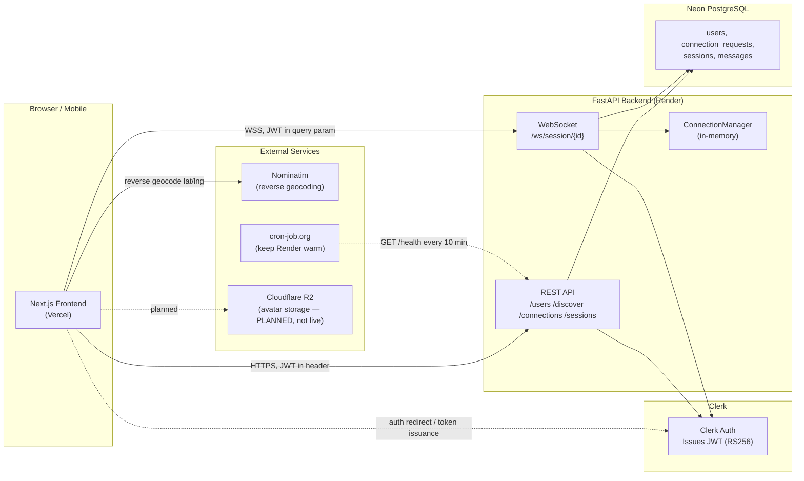
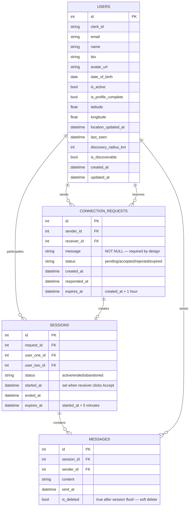
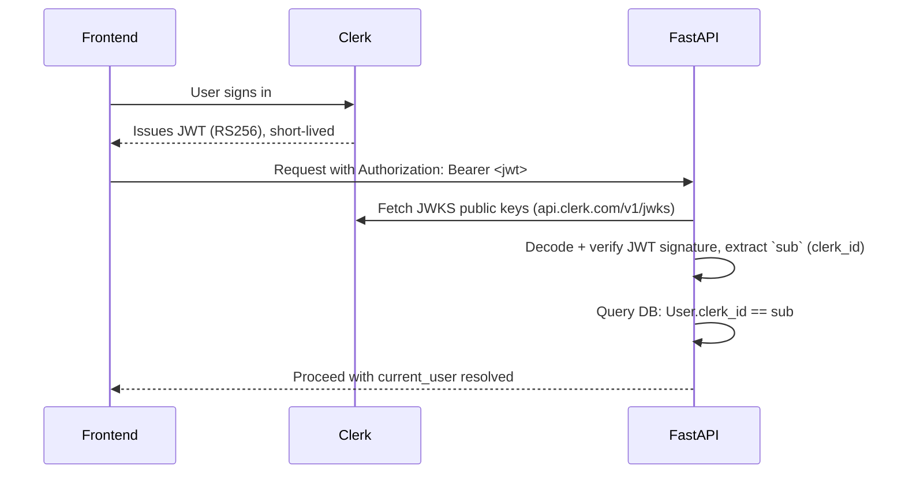
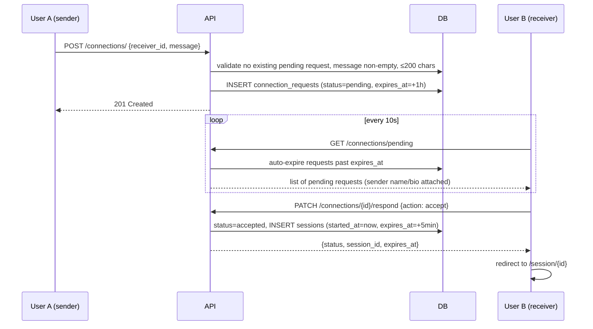
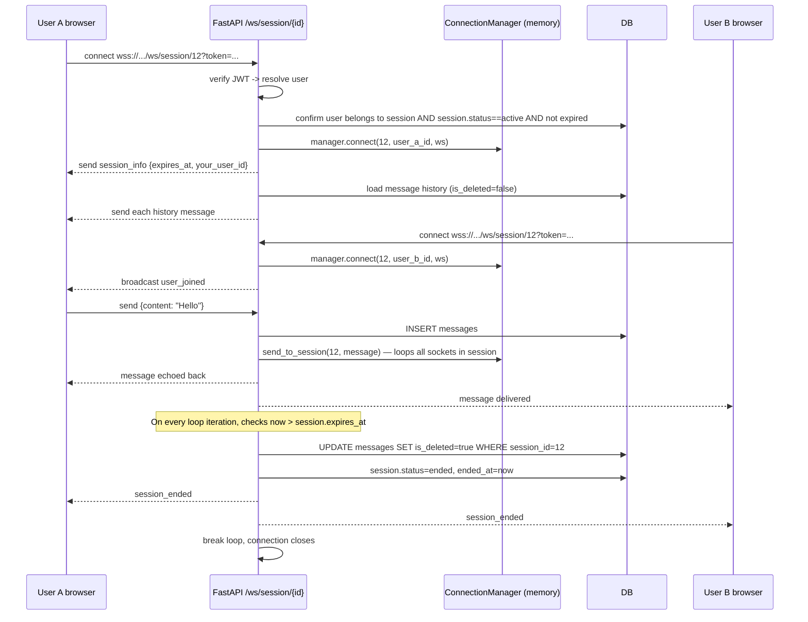
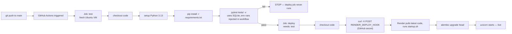

# BlaBlaGoa — Engineering Context Document

> This document exists to bring any AI coding assistant (Copilot, Claude, etc.) or new
> contributor up to speed on the BlaBlaGoa project — what it does, how it's built, how
> it's deployed, and what's still fragile or unfinished. It spans two repositories.
> Read the relevant repo section fully before making changes there.

---

## Table of Contents

1. [Product Aim & Vision](#1-product-aim--vision)
2. [System Architecture Overview](#2-system-architecture-overview)
3. [Repositories & Where Things Live](#3-repositories--where-things-live)
4. [Database Schema (shared source of truth)](#4-database-schema-shared-source-of-truth)
5. [BACKEND — `BlaBlaGoa` repo](#5-backend--blablagoa-repo)
6. [FRONTEND — `blablagoa-frontend` repo](#6-frontend--blablagoa-frontend-repo)
7. [CI/CD Pipeline](#7-cicd-pipeline)
8. [Known Potential Issues & Scaling Limits](#8-known-potential-issues--scaling-limits)
9. [Roadmap / What's Next](#9-roadmap--whats-next)
10. [Common Gotchas & Debugging Notes](#10-common-gotchas--debugging-notes)

---

## 1. Product Aim & Vision

BlaBlaGoa is a **location-based ephemeral chat app**. The core idea: you set your
location, see who else is nearby and currently active, send them a connection request
**with a required message explaining why** you want to talk, and — if they accept —
you get exactly **5 minutes** to chat before everything is permanently deleted.

**Why these specific design choices:**

- **Message required on every request** — this is the product's main differentiator.
  No blank/spam connection requests. The receiver always has context ("just landed,
  want to share a cab?") before deciding to accept. This is enforced at the database
  level (`message` column is `NOT NULL`).
- **5-minute ephemeral sessions** — low-pressure, low-commitment conversations.
  Messages are flushed (soft-deleted) the moment the timer hits zero. No chat history
  to manage long-term, no awkward "do I keep talking to this stranger forever" problem.
- **Online-only discovery** — you only see people who are *currently* on the app, not a
  static directory of everyone who ever signed up nearby. This mimics dating-app-style
  "active now" discovery rather than a social network.

Primary use cases: sharing a cab at the airport, finding people in a new city, casual
"someone interesting nearby" conversations.

---

## 2. System Architecture Overview



**Protocol decision rule used throughout the app:**

| Use case | Protocol | Why |
|---|---|---|
| Auth, profile, location set, requests, accept/reject | HTTPS REST | One-shot actions, stateless |
| Presence heartbeat | HTTPS REST, polled every 30s | Simple, cheap, fine at this scale |
| Nearby user discovery | HTTPS REST, on demand | Triggered by user action / refresh |
| Pending request notifications | HTTPS REST, polled every 10s | Rare events, polling is cheap enough |
| Chat messages | **WebSocket (WSS)** | Server must push to client without being asked |
| Session countdown | Client-side only | Computed from `expires_at`, server is source of truth |

---

## 3. Repositories & Where Things Live

| Repo | URL | Purpose |
|---|---|---|
| Backend | `github.com/pranavrathod10/BlaBlaGoa` | FastAPI + PostgreSQL + WebSocket |
| Frontend | `github.com/pranavrathod10/blablagoa-frontend` | Next.js 16 + TypeScript + Tailwind |

| Environment | URL | Notes |
|---|---|---|
| Backend (Render) | `https://blablagoa-backend.onrender.com` | Docker container, free tier (cold starts) |
| Frontend (Vercel) | `https://blablagoa-frontend.vercel.app` | A rename to `blablagoa.vercel.app` was discussed but **not confirmed completed** — verify current canonical URL before assuming it changed. If it has changed, update CORS in backend `main.py` and the Clerk allowed-domains list accordingly. |
| Database | Neon PostgreSQL, `ap-southeast-1` region | Free tier |
| Auth | Clerk | Currently using **development keys** (`pk_test_...` / `sk_test_...`) — must be swapped for production keys before real public launch |

---

## 4. Database Schema (shared source of truth)

The database is owned by the backend repo (SQLAlchemy models + Alembic migrations),
but the frontend's TypeScript interfaces in `lib/api.ts` must always mirror it.
**Any schema change on the backend requires a matching interface update on the frontend.**



**Key design decisions baked into this schema:**

- `status` fields are strings, not booleans — every entity has 3-4 possible states,
  a boolean can't represent that, and strings are self-documenting in raw SQL queries.
- `expires_at` is computed and stored at creation time on both `connection_requests`
  and `sessions` — any part of the system can check expiry with a single timestamp
  comparison, no timezone math needed elsewhere.
- `last_seen` (not a boolean `is_online`) — see heartbeat pattern in §5.4. Avoids the
  classic "user closed tab, is_online stuck at true forever" bug.
- `messages.is_deleted` is a soft delete — rows are marked, not removed. Cheap UPDATE
  instead of DELETE, auditable, and a future background job could hard-delete after
  24h if storage becomes a concern.

---

## 5. BACKEND — `BlaBlaGoa` repo

### 5.1 Tech stack

| Layer | Choice |
|---|---|
| Framework | FastAPI (Python 3.13) |
| ORM | SQLAlchemy |
| Migrations | Alembic |
| Validation | Pydantic v2 |
| Database | PostgreSQL (Neon, free tier) |
| Auth | Clerk (JWT, RS256, verified via JWKS) |
| WebSockets | `uvicorn[standard]` + `websockets` package |
| Rate limiting | `slowapi` |
| File storage (planned) | Cloudflare R2 via `boto3` (S3-compatible) — **not yet implemented/pushed** |
| Geocoding (frontend-triggered) | Nominatim (OpenStreetMap), no API key |
| Containerization | Docker |
| Hosting | Render (free tier, Docker runtime, Singapore region) |
| CI/CD | GitHub Actions |

### 5.2 Folder structure

```
BlaBla/
├── app/
│   ├── main.py                  # FastAPI app, CORS, router registration, /health
│   ├── core/
│   │   ├── config.py            # pydantic-settings, reads .env / env vars
│   │   ├── database.py          # SQLAlchemy engine, SessionLocal, get_db()
│   │   └── auth.py              # Clerk JWT verification, get_current_user dependency
│   ├── models/
│   │   ├── user.py              # User SQLAlchemy model + Pydantic schemas
│   │   ├── connection.py        # ConnectionRequest model + schemas
│   │   ├── session.py           # Session model + schemas
│   │   └── message.py           # Message model + schemas
│   ├── routers/
│   │   ├── users.py             # /users/* — profile CRUD, avatar upload endpoint (planned)
│   │   ├── discover.py          # /discover/* — location, presence, nearby
│   │   ├── connections.py       # /connections/* — send, pending, sent, respond
│   │   ├── sessions.py          # /sessions/* — active sessions, get one session
│   │   └── websocket.py         # /ws/session/{id} — the chat itself
│   └── services/
│       ├── user_service.py
│       ├── connection_service.py
│       ├── discovery_service.py # Haversine query lives here
│       └── upload_service.py    # R2 upload logic — written, NOT verified working
├── alembic/
│   ├── env.py
│   └── versions/                # ⚠️ must NOT be in .dockerignore (see §10)
├── tests/
│   ├── conftest.py               # SQLite test DB, fixtures, dependency overrides
│   └── test_users.py             # 9 passing tests
├── .github/workflows/deploy.yml  # CI/CD pipeline
├── Dockerfile
├── startup.sh                    # runs `alembic upgrade head` then uvicorn
├── .dockerignore
└── requirements.txt
```

### 5.3 Auth flow (Clerk JWT)



- `verify_clerk_token()` does the JWKS fetch + decode.
- `get_current_user()` wraps that and resolves to the internal `User` row.
- **WebSocket auth is different**: browsers cannot set custom headers on a WS upgrade
  request, so the JWT is passed as a query parameter instead:
  `wss://.../ws/session/12?token=eyJ...`. Still encrypted in transit (WSS = TLS).

### 5.4 Discovery & location system

Three independent pieces working together — do not conflate them when modifying:

1. **Setting location** — `PATCH /discover/me/location` — only fires when the user
   explicitly clicks "Use current location" or picks a place. Stores `latitude`,
   `longitude`, `location_updated_at`, and bumps `last_seen`.
2. **Presence heartbeat** — `PATCH /discover/me/presence` — frontend fires this every
   30 seconds while the user is on the Connect page. Updates `last_seen` only.
3. **Nearby query** — `GET /discover/nearby` — Haversine formula computed **inside
   PostgreSQL**, not in Python, so the DB filters before any data crosses the wire.

```sql
SELECT * FROM (
    SELECT id, name, bio, avatar_url, last_seen,
        (6371 * acos(
            LEAST(1.0, (
                cos(radians(:lat)) * cos(radians(latitude)) *
                cos(radians(longitude) - radians(:lng)) +
                sin(radians(:lat)) * sin(radians(latitude))
            ))
        )) AS distance_km
    FROM users
    WHERE id != :user_id
      AND is_discoverable = true
      AND is_active = true
      AND last_seen > :online_threshold
      AND latitude IS NOT NULL AND longitude IS NOT NULL
) AS nearby
WHERE distance_km <= :radius_km
ORDER BY distance_km ASC
```

- `HAVING` cannot be used here without `GROUP BY` in PostgreSQL — must stay wrapped
  as a subquery with the outer `WHERE`, this was a real bug hit during development.
- `LEAST(1.0, ...)` guards against floating-point values like `1.0000000001` which
  would otherwise crash `acos()` with a math domain error.
- **`online_threshold` is currently 60 seconds** (`now - 60s`). A change to a longer
  window (e.g. 10 minutes) was proposed during development to reduce the "both users
  must have the Connect page open simultaneously" friction, but the team explicitly
  **chose to keep the original 60-second threshold** and instead improve the
  empty-state messaging on the frontend ("People appear here when they open the
  Connect page..."). **Do not assume the threshold was extended — verify in
  `discovery_service.py` before relying on this.**

### 5.5 Connection requests flow



Rejection just sets `status = rejected` — no session created.
Expiry (1 hour, unresponded) is lazily checked on every `GET /connections/pending`
call rather than via a background cron job.

### 5.6 WebSocket chat system

This is the most architecturally significant part of the backend.

**`ConnectionManager`** (`app/routers/websocket.py`) — a singleton, in-memory
dictionary mapping `session_id -> list of (user_id, WebSocket)`. This is **not**
backed by the database — WebSocket connections are live TCP sockets and can only
live in process memory.

```python
class ConnectionManager:
    def __init__(self):
        self.active: dict[int, list[tuple[int, WebSocket]]] = {}
```



**WebSocket message protocol** — every message has a `type` field, both sides agree
on the contract:

| `type` | Direction | Payload | Meaning |
|---|---|---|---|
| `session_info` | server → client | `session_id, expires_at, your_user_id` | Sent once on connect |
| `message` | server → client (broadcast, incl. sender) | `id, sender_id, sender_name, content, sent_at` | A chat message, saved to DB before broadcast |
| `user_joined` | server → client | `user_id, user_name` | Other participant connected |
| `user_left` | server → client | `user_id, user_name` | Other participant's socket disconnected |
| `session_ended` | server → client | `message` | Timer expired, messages flushed, socket about to close |
| `error` | server → client | `message` | e.g. message too long (>500 chars) |
| *(raw)* | client → server | `{content: string}` | The only thing the client ever sends |

**Why the timer is server-authoritative**: `expires_at` is set once in the database
when the session is created. The server checks `now > session.expires_at` on every
iteration of the receive loop — independent of what the client's JavaScript is doing.
The client-side countdown (`useState` + `setInterval` in the frontend) is **display
only**; it cannot extend or cheat the session length. Even a paused/backgrounded
browser tab will still receive `session_ended` because the server enforces it.

**Known structural limitation**: `ConnectionManager` lives in a single process's
memory. If Render restarts the container, all active WebSocket connections drop
immediately (acceptable for 5-minute sessions, but worth knowing). If the backend is
ever scaled to multiple instances (e.g. on AWS ECS with 2+ tasks), User A's socket
might land on instance 1 and User B's on instance 2 — they would never receive each
other's messages, because each instance has its own independent `ConnectionManager`.
**This must be solved with Redis pub/sub before horizontal scaling.** See §8.

### 5.7 Rate limiting & security

- **Rate limiting** is implemented via `slowapi`, confirmed working in the current
  deployed state. Historically, applying `@limiter.limit(...)` directly inside
  `app/routers/connections.py` caused a `NameError: name 'limiter' is not defined`
  because the limiter instance lives in `app/main.py` and wasn't properly scoped/
  imported into the router module — this was fixed, but **double-check the exact
  decorator placement and import path in the current code** before assuming a
  specific rate (e.g. "10/minute") is still in effect, since the fix path taken
  isn't fully documented in this history.
- **Independent of slowapi**, `connection_service.send_request()` already prevents
  spam at the application logic level — it rejects a new request if a `pending`
  request already exists between the same sender/receiver pair. This check exists
  regardless of rate limiter state and should not be removed.
- **WebSocket authorization** double-checks that the connecting user is actually
  `user_one_id` or `user_two_id` on that specific session — prevents arbitrary users
  from connecting to someone else's chat by guessing a session ID.
- **CORS** is configured explicitly with an allow-list in `main.py` — currently:
  `http://localhost:3000` and the production Vercel URL. Must be updated any time the
  frontend domain changes.

### 5.8 API endpoint reference

| Method | Path | Auth | Purpose |
|---|---|---|---|
| GET | `/health` | none | Health check, pinged by cron-job.org |
| PATCH | `/users/me` | JWT | Update profile (name, bio, dob, is_discoverable) |
| POST | `/users/me/avatar` | JWT | Upload avatar to R2 — **written, not confirmed working** |
| PATCH | `/discover/me/location` | JWT | Set lat/long, bump last_seen |
| PATCH | `/discover/me/presence` | JWT | Heartbeat, bump last_seen only |
| GET | `/discover/nearby` | JWT | Haversine query for nearby online users |
| POST | `/connections/` | JWT | Send a connection request (message required) |
| GET | `/connections/pending` | JWT | Incoming pending requests (auto-expires stale ones) |
| GET | `/connections/sent` | JWT | Requests sent by current user |
| PATCH | `/connections/{id}/respond` | JWT | Accept (creates Session) or reject |
| GET | `/sessions/active` | JWT | All active sessions for current user (auto-ends expired) |
| GET | `/sessions/{id}` | JWT | One session's details + other user's name |
| WS | `/ws/session/{id}` | JWT (query param) | The chat itself |

### 5.9 Migrations / Alembic workflow

**Critical workflow** — every schema change requires both steps, in order:

```bash
# 1. Edit the SQLAlchemy model (app/models/*.py)
# 2. Generate the migration file
alembic revision --autogenerate -m "description of change"
# 3. Apply it locally to verify
alembic upgrade head
# 4. Commit BOTH the model change and the new migration file
git add .
git commit -m "..."
git push
```

On every deploy, `startup.sh` runs `alembic upgrade head` automatically before
starting uvicorn. If you forget step 2/3 and only push the model change, the model
will reference a column that doesn't exist in the actual database yet — this exact
mistake happened with the `message` column on `connection_requests` and caused a
`TypeError: 'message' is an invalid keyword argument for ConnectionRequest` in
production.

### 5.10 Backend deployment

- **Render**, Docker runtime, Singapore region, free tier.
- `startup.sh`:
  ```bash
  #!/bin/bash
  echo "Running database migrations..."
  alembic upgrade head
  echo "Starting FastAPI server..."
  uvicorn app.main:app --host 0.0.0.0 --port 8000
  ```
- `Dockerfile` builds the image; `.dockerignore` **must not** exclude
  `alembic/versions/` — this was a real production incident
  (`Can't locate revision ...` error) caused by exactly that.
- A free **cron-job.org** job pings `/health` every 10 minutes to reduce (not
  eliminate) Render free-tier cold starts.
- Render's **Deploy Hook** (a secret POST URL) is what GitHub Actions calls to
  trigger redeployment — see §7.

### 5.11 Backend environment variables

(names only — actual values live in Render dashboard / local `.env`, never commit them)

```
DATABASE_URL
APP_NAME
DEBUG
SECRET_KEY
CLERK_SECRET_KEY
CLERK_PUBLISHABLE_KEY
R2_ACCOUNT_ID            # planned, for avatar upload
R2_ACCESS_KEY_ID         # planned
R2_SECRET_ACCESS_KEY     # planned
R2_BUCKET_NAME           # planned
R2_PUBLIC_URL            # planned
```

---

## 6. FRONTEND — `blablagoa-frontend` repo

### 6.1 Tech stack

| Layer | Choice |
|---|---|
| Framework | Next.js 16 (App Router), TypeScript |
| Styling | Tailwind CSS |
| Auth | `@clerk/nextjs` |
| Hosting | Vercel (auto-deploy on push, zero config) |
| Error handling | `react-error-boundary` |
| Geocoding | Nominatim REST calls directly from the client |

### 6.2 Folder & route structure

```
blablagoa-frontend/
├── app/
│   ├── page.tsx                       # Landing page (public)
│   ├── layout.tsx                     # ClerkProvider + font
│   ├── sign-in/[[...sign-in]]/page.tsx
│   ├── sign-up/[[...sign-up]]/page.tsx
│   └── (authenticated)/
│       ├── layout.tsx                 # Navbar + ErrorBoundary wrapper
│       ├── dashboard/page.tsx
│       ├── connect/page.tsx           # Location + nearby users + request modal
│       ├── activity/page.tsx          # Received / Sent tabs — MOBILE RESPONSIVE ✅
│       ├── causerie/page.tsx          # Active sessions list, live countdowns
│       ├── session/[id]/page.tsx      # WebSocket chat UI + countdown
│       └── profile/page.tsx           # Edit profile, dirty tracking, validation
├── components/
│   ├── navbar.tsx                     # Logo→landing, Dashboard/Connect/Activity/Causerie/Profile links
│   └── ui/                            # shadcn/ui components
├── lib/
│   └── api.ts                         # All API functions + TypeScript interfaces
├── proxy.ts                           # Clerk middleware (route protection)
└── .env.local                         # gitignored
```

### 6.3 API client pattern (`lib/api.ts`)

All backend calls go through a single `fetchWithAuth(path, token, options)` helper
that attaches `Authorization: Bearer <token>` and the base API URL
(`NEXT_PUBLIC_API_URL`) automatically. Every endpoint has a typed wrapper function
(e.g. `getNearbyUsers`, `sendConnectionRequest`, `respondToRequest`) returning a typed
interface that **must stay in sync with the backend Pydantic response models** (§4).

WebSocket connections are created via a dedicated helper, not through
`fetchWithAuth`, since the protocol differs entirely:

```typescript
export function createChatWebSocket(sessionId: number, token: string): WebSocket {
    const wsBase = (process.env.NEXT_PUBLIC_API_URL || "http://localhost:8000")
        .replace("https://", "wss://")
        .replace("http://", "ws://")
    return new WebSocket(`${wsBase}/ws/session/${sessionId}?token=${token}`)
}
```

### 6.4 Auth integration

`useAuth()` and `useUser()` from `@clerk/nextjs`. Every authenticated API call does:

```typescript
const token = await getToken({ skipCache: true })
```

`skipCache: true` is used deliberately on every call — Clerk's cached token can be
stale across the 30s heartbeat / 10s polling intervals used throughout this app.

### 6.5 Key state patterns used repeatedly

| Pattern | Where used | Why |
|---|---|---|
| `useRef` for WebSocket | session page | Avoids re-renders on every connection state change; survives re-renders without recreating the socket |
| `useRef` "fired once" flag | countdown `onExpire` | Prevents the expiry callback firing every second once the timer hits zero |
| `setInterval` heartbeat + cleanup | connect page (30s) | `return () => clearInterval(...)` is mandatory — without it, navigating away leaves a zombie timer running |
| Polling with `setInterval` | activity (10s), causerie (15s) | Cheaper than WebSockets for low-frequency, non-critical updates |
| Debounced API call | radius slider on connect page (500ms) | Prevents firing dozens of requests while dragging |
| Dirty-state tracking | profile page | Skips the API call entirely if nothing actually changed; Save button visually reflects clean/dirty/saved state |
| `useCallback` for fetch functions | connect page | Prevents `useEffect` dependency loops |

### 6.6 Page-by-page summary

| Page | Responsibility |
|---|---|
| `/` | Public landing page |
| `/connect` | Set/search location (Nominatim forward+reverse geocoding), GPS button, radius slider, nearby user cards, profile modal with required message field, incoming-request notifications (10s poll), 30s presence heartbeat |
| `/activity` | Received tab (accept/decline) + Sent tab (status badges), 10s poll |
| `/causerie` | List of all active sessions with independent live countdown timers per session |
| `/session/[id]` | WebSocket connection, message history load, real-time chat, countdown timer, "session ended" screen |
| `/profile` | Edit name/bio/DOB, discoverable toggle, dirty tracking, validation, account info (read-only: email, radius, member since) |
| `/dashboard` | Welcome + profile summary + CTA into Connect |

### 6.7 Mobile responsive status

**Only a few pages have had the responsive pass applied — do not assume the whole
app is mobile-ready.** Confirmed pattern used (apply consistently to remaining pages):

```tsx
// Two-panel layouts: stack vertically on mobile
<div className="flex flex-col md:flex-row gap-6 md:h-[calc(100vh-8rem)]">

// Fixed-width side panels: full width on mobile
<div className="w-full md:w-72 md:shrink-0 ...">

// Padding: tighter on mobile
<div className="p-4 md:p-8">

// Text truncation on cards with long names
<p className="truncate"> inside a parent with min-w-0
```

The **Activity page** has the full pass applied (tabs become full-width/`flex-1` on
mobile, padding reduced, names truncate). **Connect, Causerie, Session, Profile,
Dashboard, and the Navbar (hamburger menu for nav links) still need this pass —
verify each individually rather than assuming it's done.**

### 6.8 Frontend deployment

- **Vercel**, auto-deploys on every push to `main`, zero-config Next.js detection.
- Environment variables set directly in the Vercel dashboard (mirrors `.env.local`).
- Current production URL: `https://blablagoa-frontend.vercel.app` (rename to
  `blablagoa.vercel.app` was discussed, **not confirmed completed** — verify).
- Any URL change requires updating: backend CORS allow-list, Clerk's allowed domains
  list.

### 6.9 Frontend environment variables

```
NEXT_PUBLIC_CLERK_PUBLISHABLE_KEY
CLERK_SECRET_KEY
NEXT_PUBLIC_API_URL
NEXT_PUBLIC_CLERK_SIGN_IN_URL
NEXT_PUBLIC_CLERK_SIGN_UP_URL
NEXT_PUBLIC_CLERK_AFTER_SIGN_IN_URL
NEXT_PUBLIC_CLERK_AFTER_SIGN_UP_URL
NEXT_PUBLIC_CLERK_SIGN_IN_FALLBACK_REDIRECT_URL
NEXT_PUBLIC_CLERK_SIGN_UP_FALLBACK_REDIRECT_URL
```

---

## 7. CI/CD Pipeline

**Backend (`BlaBlaGoa` repo)** — GitHub Actions, two jobs, gated:



`.github/workflows/deploy.yml` sets these env vars directly in the `test` job
(the CI runner has no `.env` file, so `pydantic-settings` would otherwise fail with
"Field required" errors — this was a real bug hit during setup):

```yaml
env:
  DATABASE_URL: sqlite:///./test.db
  APP_NAME: BlaBlaGoa
  DEBUG: "True"
  SECRET_KEY: test-secret-key-for-ci
  CLERK_SECRET_KEY: test-clerk-secret-key
  CLERK_PUBLISHABLE_KEY: test-clerk-publishable-key
```

`tests/conftest.py` overrides `get_db()` to point at an isolated SQLite test
database regardless of what `DATABASE_URL` says — so the placeholder value above
is never actually connected to.

The only GitHub secret required: `RENDER_DEPLOY_HOOK` (a POST URL from Render's
dashboard — calling it triggers a redeploy without giving GitHub any Render
credentials).

**Frontend (`blablagoa-frontend` repo)** — no custom workflow file needed. Vercel's
GitHub integration auto-builds and deploys on every push to `main`. This is one of
the reasons Vercel was chosen over manually configuring a Next.js deploy pipeline.

---

## 8. Known Potential Issues & Scaling Limits

Ordered by what breaks first as usage grows:

| # | Issue | Trigger point | Fix |
|---|---|---|---|
| 1 | Render free-tier cold start (30-60s) | Every user, today | Cron job mitigates partially; paid plan ($7/mo) removes it entirely |
| 2 | `ConnectionManager` is in-memory, single-process | Any Render restart, or horizontal scaling | Acceptable for 5-min sessions on one instance; **must** move to Redis pub/sub before running 2+ backend instances |
| 3 | Discovery requires both users to have opened Connect recently (60s online window) | Always, by design — Option A was chosen deliberately over extending the window | Currently mitigated only via frontend messaging, not a backend change |
| 4 | Polling load (10s/15s/30s intervals per active user) | ~500+ concurrent users | Replace polling with WebSocket-based presence/notifications |
| 5 | Haversine query scans all users on every call | ~50,000+ users | Add a DB index on `(latitude, longitude)`; beyond ~500k users move to PostGIS |
| 6 | Rate limiter scope bug history | Already fixed once, but unverified current exact config | Re-audit `slowapi` decorator placement before relying on a specific limit |
| 7 | Avatar upload to R2 | Not live yet | Code drafted in `upload_service.py`, **never confirmed pushed/working** — needs R2 bucket creation, credentials, and end-to-end test |
| 8 | No automatic WebSocket reconnection on network drop | Any flaky connection mid-chat | Frontend currently shows "Connecting..." but does not retry; add reconnect-with-backoff logic |
| 9 | Mobile responsiveness incomplete | Any phone user on Connect/Causerie/Session/Profile/Dashboard | Apply the pattern in §6.7 to remaining pages |
| 10 | Clerk is on development keys | Before any real public launch | Must switch to production keys; dev keys have strict usage limits per Clerk's own warning banner |
| 11 | No CDN/caching for avatar images (once implemented) | At scale, once R2 is live | Add Cloudflare CDN in front of the R2 public bucket (R2 itself has zero egress fees, unlike S3) |

---

## 9. Roadmap / What's Next

```
Now / soon:
  - Finish avatar upload (R2): create bucket, add env vars to Render + local .env,
    test the full upload → save URL → display flow end-to-end
  - Complete mobile responsive pass on Connect, Causerie, Session, Profile,
    Dashboard, and Navbar (hamburger menu)
  - Add WebSocket reconnection-with-backoff on the session page
  - Re-verify rate limiter configuration is correctly scoped

At ~100 users:
  - Render paid plan ($7/mo) — eliminates cold starts entirely

At ~500 concurrent users:
  - Replace presence/notification polling with WebSocket-based push
  - Move ConnectionManager state into Redis (required before any horizontal scaling)

At ~2,000+ users:
  - AWS migration: ECR (image registry) → ECS (container orchestration, auto-scaling)
    → ALB (load balancer, HTTPS termination) → RDS PostgreSQL → ElastiCache Redis
  - Same Dockerfile and startup.sh — only infrastructure changes, application code
    does not need to change for this migration

At ~50,000+ users:
  - PostGIS spatial index replaces the raw Haversine SQL query
  - CDN (CloudFront or Cloudflare) in front of avatar storage
```

PWA support (installable on phones, `next-pwa`, manifest.json) was also discussed as
a polish item but not yet started.

---

## 10. Common Gotchas & Debugging Notes

These are real issues hit during development — worth knowing before "fixing" the
same thing twice.

- **Local Alembic commands failing with DNS errors** (`could not translate host name
  ...neon.tech`) — happened repeatedly on macOS. Fix applied: set DNS manually to
  `8.8.8.8` / `8.8.4.4` either via `networksetup` (temporary) or System Settings →
  Network → DNS (permanent). This only affects running Alembic *locally*; Render's
  own network was never affected.
- **`alembic/versions/` must never be in `.dockerignore`** — caused a real production
  incident where Render couldn't locate a migration revision because the version
  files simply weren't copied into the Docker image.
- **Forgetting to run `alembic revision --autogenerate` after a model change** — the
  model will reference a column the real database doesn't have yet. Always pair every
  model edit with a generated + committed migration file (see §5.9).
- **PostgreSQL `HAVING` requires `GROUP BY`** — the original nearby-users query used
  `HAVING distance_km <= :radius_km` directly and threw a syntax error in production.
  Fixed by wrapping the calculation in a subquery and filtering with an outer `WHERE`.
- **`venv` not activated** — `alembic`/`uvicorn`/`pytest` "command not found" errors
  almost always mean `source venv/bin/activate` wasn't run in that terminal session.
- **CI failing with `pydantic_core.ValidationError: DATABASE_URL Field required`** —
  the GitHub Actions runner has no `.env` file; required env vars must be declared
  directly in the workflow YAML's `env:` block for the `test` job.
- **WebSocket 404 in production logs** — caused by uvicorn missing the WebSocket
  extras (`pip install 'uvicorn[standard]' websockets`) and/or the WebSocket router
  not being included correctly in `main.py`.
- **Render redeploy not picking up a push** — always check the **Events** tab in the
  Render dashboard for a new deployment timestamp before assuming code changes are
  live; a manual "Deploy latest commit" is the fallback.
